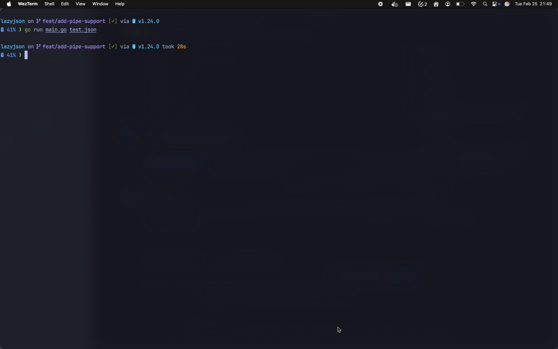

# LazyJSON

> **A Note on Collaboration:** This project was primarily developed as an experiment to test AI prompting techniques and evaluate the capabilities of AI coding assistants (👋 Cascade!). While the AI generated a significant portion of the code, it required specific guidance, refinement, and occasional manual intervention to achieve the desired functionality and structure.

Interactive TUI JSON viewer with tree navigation, expand/collapse functionality, and real-time filtering.



## Features

- 🌳 Tree-based JSON navigation
- ⌨️ Vim-style keyboard shortcuts
- 🔍 Real-time JSON filtering
- 📁 Support for large JSON files
- 🎨 Syntax highlighting
- 🔄 Expand/Collapse nodes

## Installation

```bash
go install github.com/cksidharthan/lazyjson@latest
```

Or build from source:

```bash
git clone https://github.com/cksidharthan/lazyjson.git
cd lazyjson
go build
```

## Usage

### Basic Usage

```bash
# View a JSON file
lazyjson example.json

# View JSON from a URL
curl https://api.example.com/data.json > data.json && lazyjson data.json
```


### Navigation

- `↑/k`: Move cursor up
- `↓/j`: Move cursor down
- `Enter/Space`: Expand/Collapse node
- `h`: Collapse node
- `l`: Expand node
- `q`: Quit

### Filtering

Type to filter JSON nodes in real-time. The filter supports:
- Exact matches
- Partial matches
- Case-insensitive search

## Contributing

Contributions are welcome! Please feel free to submit a Pull Request.

## License

MIT License - see [LICENSE](LICENSE) for details
